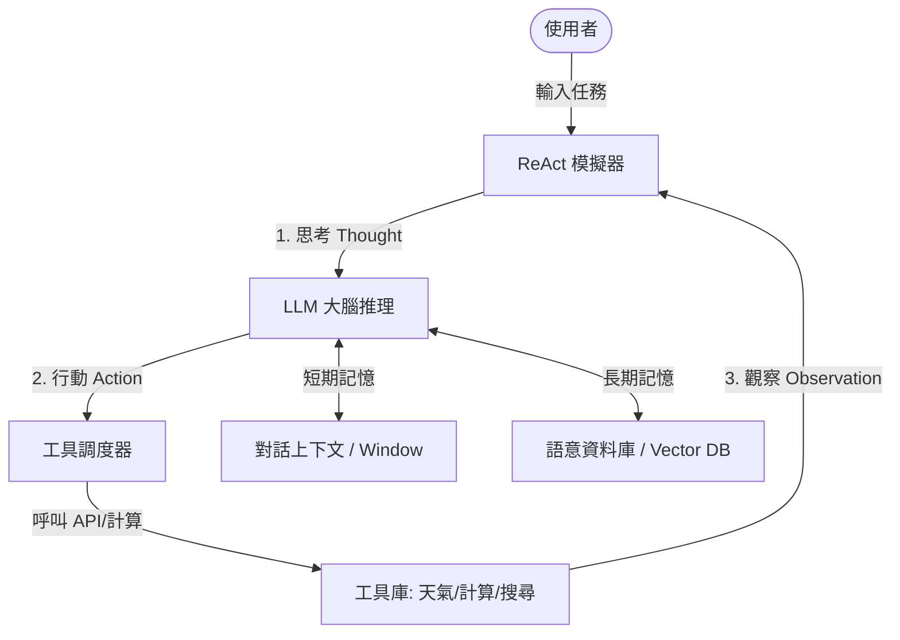

# AI Agent 互動學習與模擬平台 - 專案工作藍圖 (Project Blueprint)

本文件用於記錄「AI Agent 互動學習與模擬平台」的專案藍圖、架構設計、開發進度與後續規劃。

---

## 🎯 專案目標
打造一個極具視覺衝擊力、強互動性且富有教育意義的單頁面 Web 應用程式 (SPA)，讓使用者能直觀地學習與體驗 AI Agent 的各項核心技術（大腦推理、規劃、記憶與工具呼叫）。

---

## 🛠️ 技術堆疊
- **開發框架**：React + Vite + TailwindCSS (或自訂 CSS)
- **視覺與特效**：Vanilla CSS 3D/毛玻璃 (Glassmorphism) 特效 + Canvas 粒子動畫
- **圖標庫**：Lucide React
- **部署/執行環境**：Node.js

---

## 🏗️ 系統架構藍圖 (Architecture)

### 核心模組設計
1. **Interactive Architecture Canvas**
   - 互動式 Agent 架構解構圖（大腦、規劃、記憶、工具）。
2. **ReAct Loop Simulator**
   - 單步執行 (Step-by-step) 模擬 Thought -> Action -> Observation -> Final Answer 的完整 ReAct 迴圈。
3. **Memory Visualizer (短期 & 長期記憶)**
   - 視覺化展示短期記憶滑動與長期記憶 (Vector Search/RAG) 的檢索流程。
4. **Code Lab**
   - 展示如何用最精簡的 Python / TypeScript 程式碼寫出一個 Agent 迴圈。

---

## 📋 工作任務與進度追蹤 (Roadmap)

- [ ] **階段一：環境初始化與基礎架構**
  - [ ] 初始化 Vite + React 專案環境
  - [ ] 設定全域樣式（深色模式、毛玻璃變數、科技感配色）
  - [ ] 建立專案骨架與導覽列
- [ ] **階段二：核心功能開發**
  - [ ] **2.1 互動架構圖**：設計 Canvas / SVG 互動圖，並撰寫各模組的知識卡片
  - [ ] **2.2 ReAct 模擬器**：實作可單步執行的狀態機，模擬工具呼叫過程
  - [ ] **2.3 記憶視覺化**：製作 RAG / 向量檢索的動畫與短期記憶 Token 變化條
  - [ ] **2.4 程式碼實驗室**：加入語法高亮的程式碼區塊與對照表
- [ ] **階段三：視覺與動態優化**
  - [ ] 加入呼吸燈、數據流向的粒子動畫
  - [ ] 優化 RWD 響應式佈局
- [ ] **階段四：測試與交付**
  - [ ] 進行完整功能測試，修正潛在 Bug
  - [ ] 撰寫 Walkthrough 與使用手冊

---

## 📝 變更與維護日誌
- **2026-07-09**: 初始化 `agent.MD` 工作藍圖，規劃專案核心架構與任務清單。
